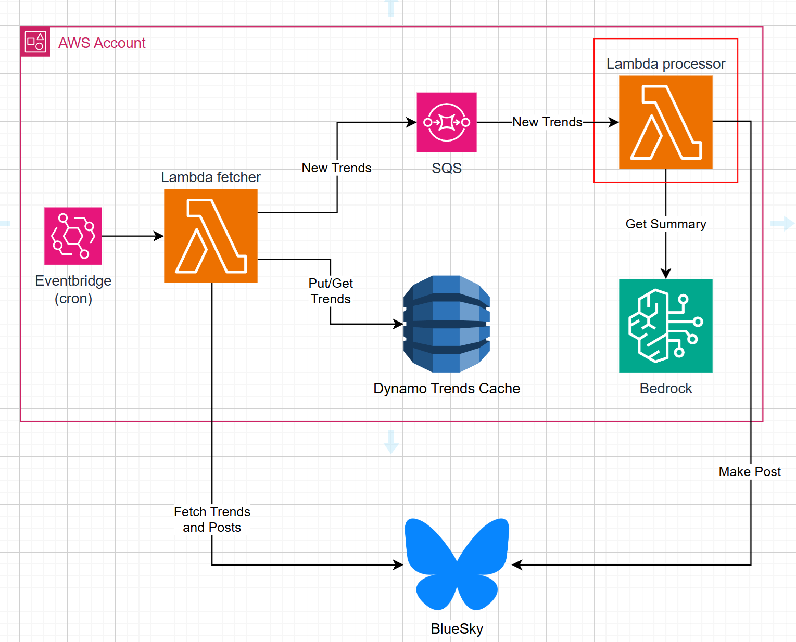

# Out of the Loop - Processor

Lambda function responsible for summarizing posts using Bedrock and using the summaries to post to Bluesky.

This lambda:
- Consumes the posts from the SQS queue.
- Summarizes the posts using Amazon Bedrock.
- Posts the summaries to Bluesky.

### Solution overview

This lambda is highlighted in red.

[Lambda Fetcher](https://github.com/carloscamposiki/outl-ai-fetcher).
### Environment Variables
- `SESSION_SECRET_NAME`: The name of the AWS Secrets Manager secret that contains the Bluesky session token. This secret allows the lambda to reuse the session token for fetching posts without needing to log in again for each execution.
- `BLUE_SKY_CREDENTIALS_SECRET_NAME`: The name of the AWS Secrets Manager secret that contains the Bluesky credentials (username and password). This is used to log in to Bluesky if the session token is not available.
- `BEDROCK_MODEL_NAME`: The name of the Amazon Bedrock model to use for summarizing posts.

### Technologies

- `AWS Lambda`: Function to run the code in a serverless environment.
- `AWS Secrets Manager`: To securely store and retrieve the Bluesky session token and credentials.
- `AWS SQS`: To consume the posts for summarization.
- `Bluesky API`: To post the summaries.
- `Python 3:11`: The programming language used for the Lambda function.
- `Boto3`: The AWS SDK for Python, used to interact with AWS services like SQS, DynamoDB, and Secrets Manager.
- `Github Actions`: For CI/CD to build and deploy the Lambda function.

### Folder structure
- `.github/workflows`: Contains the GitHub Actions workflow files for CI/CD.
- `doc`: Contains documentation files.
- `app`: Contains the source code for the Lambda function.
- `infra`: Contains the infrastructure as code files for deploying the Lambda function 
